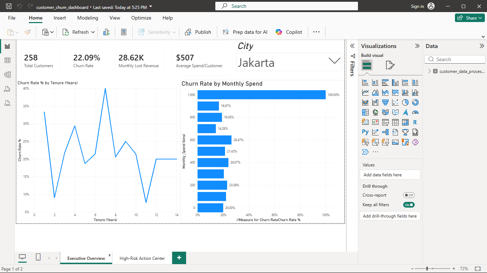
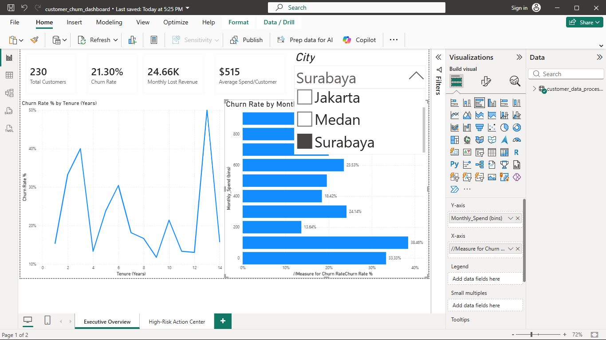

## 📉 Executive Power BI Dashboard

### 1. Executive Churn Overview



### 2. High-Risk Customer Action Center


# 🛡️ Customer Churn Sentinel: Predictive Retention Analysis

A end-to-end data science and business intelligence project designed to predict customer churn, identify key financial drivers, and prioritize high-risk customers for proactive retention campaigns.

---

## 📌 Business Problem & Overview

Customer churn directly impacts recurring revenue. Traditional accuracy-focused models often fail on imbalanced churn data because guessing "No Churn" for every customer yields high accuracy while missing 100% of churners. 

This project implements a **class-balanced machine learning model** paired with **probability threshold tuning** to maximize recall—ensuring at-risk customers are identified before they cancel.

---

## 📊 Key Findings

* **Primary Churn Drivers:** Feature importance analysis revealed that customer churn is heavily financial and behavior-driven. `Monthly_Spend` and `Tenure_Days` account for over **50% of total feature importance**.
* **Demographics vs. Geography:** Age plays a moderate role in churn risk, while geographic location (`City`) has negligible impact (< 3% importance).
* **Model Optimization:** By tuning the decision probability threshold from `0.50` to `0.30`, model **recall increased from 0% to 55%**, successfully capturing high-risk churners.

---

## 🛠️ Tech Stack & System Architecture

| Architecture Layer | Tools & Technologies |
| :--- | :--- |
| **Language & Environment** | Python 3.11, Virtual Environment (`venv`), Git/GitHub |
| **Data Ingestion & Storage** | Raw CSV Datasets |
| **Data Processing & EDA** | Pandas, NumPy |
| **Data Visualization** | Seaborn, Matplotlib |
| **Machine Learning & Modeling**| Scikit-Learn (Random Forest, Pipeline, Threshold Tuning) |
| **Model Evaluation** | Precision-Recall Curves, F1-Score, Confusion Matrix |
| **Model Persistence** | Joblib (`.pkl`) |
| **Business Intelligence & BI** | Power BI (DAX, Data Modeling, Predictive Action Dashboards) |

---

## 📦 Project Structure

```text
customer-churn-sentinel/
├── data/
│   ├── raw/
│   └── processed/
├── models/
│   └── churn_model.pkl
├── notebooks/
│   └── churn_prediction.ipynb
├── reports/
│   ├── customer_churn_dashboard.pbix
│   ├── executive_overview_1.png
│   ├── executive_overview_2.png
│   └── high_risk_action_center.png
├── .gitignore
├── README.md
└── requirements.txt