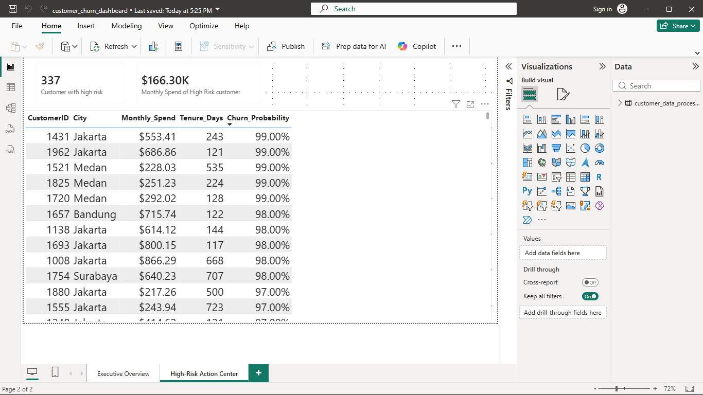

## 📉 Executive Power BI Dashboard

### 1. Executive Churn Overview


### 2. High-Risk Customer Action Center


# 🛡️ Customer Churn Sentinel: Predictive Retention Analysis

A end-to-end data science and business intelligence project designed to predict customer churn, identify key financial drivers, and prioritize high-risk customers for proactive retention campaigns.

---

## 📌 Business Problem & Overview

Customer churn directly impacts recurring revenue. Traditional accuracy-focused models often fail on imbalanced churn data because guessing "No Churn" for every customer yields high accuracy while missing 100% of churners. 

This project implements a **class-balanced machine learning model** paired with **probability threshold tuning** to maximize recall—ensuring at-risk customers are identified before they cancel.

---

## 📊 Key Findings

* **Primary Churn Drivers:** Feature importance analysis revealed that customer churn is heavily financial and behavior-driven. `Monthly_Spend` and `Tenure_Days` account for over **50% of total feature importance**.
* **Demographics vs. Geography:** Age plays a moderate role in churn risk, while geographic location (`City`) has negligible impact (< 3% importance).
* **Model Optimization:** By tuning the decision probability threshold from `0.50` to `0.30`, model **recall increased from 0% to 55%**, successfully capturing high-risk churners.

---

## 🛠️ Project Architecture & Tech Stack

* **Language:** Python 3.11
* **Data Processing & EDA:** Pandas, NumPy
* **Visualization:** Seaborn, Matplotlib
* **Machine Learning:** Scikit-Learn (Random Forest Classifier, Threshold Tuning)
* **Model Export:** Joblib
* **Business Intelligence:** Power BI

---

## 📦 Project Structure

```text
customer-churn-sentinel/
│
├── data/
│   ├── raw/               # Raw input dataset (ignored in Git)
│   └── processed/         # Cleaned data with churn probabilities
│
├── models/
│   └── random_forest_churn.pkl  # Trained Random Forest model
│
├── notebooks/
│   └── 01_eda_and_tuning.ipynb  # Data cleaning, EDA, & ML tuning
│
├── .gitignore             # Git exclusion rules
├── README.md              # Project documentation
└── requirements.txt       # Dependencies